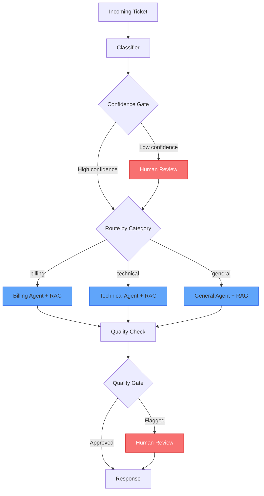

# Customer Support Ticket Processor

A multi-agent system that automatically classifies, routes, and responds to customer support tickets using LangGraph orchestration, RAG-powered specialist agents, and human-in-the-loop quality gates.

## Problem

Manual ticket triage is slow and inconsistent. Agents waste time categorizing tickets before they can help. This system automates the entire pipeline: classify the ticket, route it to a domain specialist, generate a grounded response using relevant documentation, and verify quality before sending — with human oversight at critical decision points.

## Architecture



## Key Features

- **Multi-agent orchestration** — LangGraph StateGraph with conditional routing to specialized agents
- **RAG-powered responses** — ChromaDB vector stores with domain-specific documentation (billing, technical, general)
- **Tool-calling agents** — Agents autonomously decide when to search docs, run calculations, or analyze code
- **Human-in-the-loop** — LangGraph `interrupt()` at confidence gate and quality gate for human oversight
- **Multi-LLM support** — Swap models per node (Claude, DeepSeek) via preset configs or custom mapping
- **Evaluation harness** — 30-ticket test suite with accuracy, latency, and quality metrics across model configs
- **REST API** — FastAPI with submit, resume, status, and SSE streaming endpoints
- **State persistence** — Redis checkpointer for surviving restarts (falls back to in-memory)
- **Containerized** — Docker Compose with app + Redis Stack

## Tech Stack

| Component | Technology |
|-----------|-----------|
| Orchestration | LangGraph (StateGraph, interrupt/resume, checkpointing) |
| LLMs | Claude Sonnet 4 (default), DeepSeek Chat (cost-optimized) |
| RAG | ChromaDB + HuggingFace `all-MiniLM-L6-v2` embeddings |
| API | FastAPI + SSE (sse-starlette) |
| Persistence | Redis Stack (RedisJSON + RediSearch) |
| Containerization | Docker + Docker Compose |
| Package Manager | uv |
| Testing | pytest (111 tests) |

## Quick Start

### Prerequisites

- Python 3.13+
- [uv](https://docs.astral.sh/uv/) package manager
- Anthropic API key

### Local Development

```bash
# Install dependencies
uv sync

# Set up environment
cp .env.example .env
# Edit .env with your ANTHROPIC_API_KEY

# Build vector stores (one-time)
uv run python scripts/load_documents.py

# Run the CLI demo
uv run python main.py

# Start the API server
uv run uvicorn api:app --reload
```

### Docker

```bash
# Copy and configure environment
cp .env.example .env
# Edit .env with your ANTHROPIC_API_KEY

# Build and start (app + Redis)
docker compose up --build
```

The API will be available at `http://localhost:8000` with Swagger docs at `/docs`.

## API

### Submit a ticket

```bash
curl -X POST http://localhost:8000/tickets \
  -H "Content-Type: application/json" \
  -d '{"ticket_text": "I was charged twice on my last invoice"}'
```

```json
{
  "thread_id": "abc-123",
  "status": "completed",
  "category": "billing",
  "confidence": 0.95,
  "reasoning": "Customer mentions duplicate charge and invoice",
  "response": "I understand you were charged twice. I've looked into our refund policy...",
  "quality_approved": true,
  "quality_feedback": "Response addresses the issue with specific policy details."
}
```

### Resume an interrupted ticket

When confidence is low or quality check fails, the API returns `status: "interrupted"` with an `interrupt` payload:

```bash
curl -X POST http://localhost:8000/tickets/abc-123/resume \
  -H "Content-Type: application/json" \
  -d '{"value": "billing"}'
```

### Stream ticket processing (SSE)

```bash
curl -N http://localhost:8000/tickets/stream \
  -H "Content-Type: application/json" \
  -d '{"ticket_text": "My app crashes with error 0x8007"}'
```

Events: `start` → `node_update` (per node) → `complete` or `interrupt`

### Other endpoints

| Endpoint | Method | Description |
|----------|--------|-------------|
| `/tickets` | POST | Submit a new ticket |
| `/tickets/{thread_id}` | GET | Get ticket state |
| `/tickets/{thread_id}/resume` | POST | Resume interrupted ticket |
| `/tickets/stream` | POST | SSE stream of processing |
| `/health` | GET | Health check + Redis status |

## Evaluation Results

30-ticket evaluation across model configurations:

| Metric | All Claude | Cost Optimized | All DeepSeek |
|--------|-----------|----------------|--------------|
| **Accuracy** | 93% (28/30) | — | — |
| **Quality Pass Rate** | 100% | — | — |
| **Avg Latency** | 24.1s | — | — |
| **Avg Confidence** | 0.93 | — | — |

Per-category breakdown (All Claude):

| Category | Accuracy | Correct |
|----------|----------|---------|
| Billing | 90% | 9/10 |
| Technical | 100% | 10/10 |
| General | 90% | 9/10 |

Run the eval harness yourself:

```bash
uv run python scripts/run_eval.py --configs all_claude
```

## Project Structure

```
.
├── api.py                          # FastAPI application
├── main.py                         # CLI entry point
├── Dockerfile
├── docker-compose.yml
├── pyproject.toml
├── src/
│   ├── graph.py                    # LangGraph StateGraph definition
│   ├── state.py                    # TicketState TypedDict + Pydantic schemas
│   ├── classifier.py               # Ticket classification node
│   ├── confidence_gate.py          # Human review interrupt (low confidence)
│   ├── agents.py                   # Billing, Technical, General specialist agents
│   ├── quality_check.py            # Response quality assessment node
│   ├── quality_gate.py             # Human review interrupt (quality issues)
│   ├── models.py                   # Model factory + multi-LLM presets
│   ├── checkpointer.py             # Redis/MemorySaver factory
│   ├── vector_store.py             # ChromaDB vector store builder
│   └── tools/                      # Agent tools (search, calculator, code analysis)
├── data/
│   ├── billing_docs/               # RAG documents for billing agent
│   ├── technical_docs/             # RAG documents for technical agent
│   ├── general_docs/               # RAG documents for general agent
│   └── eval_tickets.json           # 30-ticket evaluation dataset
├── scripts/
│   ├── load_documents.py           # One-time vector store initialization
│   └── run_eval.py                 # Evaluation harness
└── tests/                          # 111 pytest tests
```

## What I'd Improve With More Time

- **Async tool calls** — Run RAG searches in parallel when agents call multiple tools
- **Token-level streaming** — Stream individual tokens to the client instead of node-level updates
- **Feedback loop** — Log human corrections back to improve classifier accuracy over time
- **OpenTelemetry** — Structured tracing beyond LangSmith for production observability
- **Auth + rate limiting** — API key authentication and per-client rate limits
- **Multi-turn conversations** — Follow-up messages within the same ticket thread
- **Horizontal scaling** — Multiple API workers with shared Redis state
- **CI/CD** — GitHub Actions for tests, linting, and Docker image publishing
